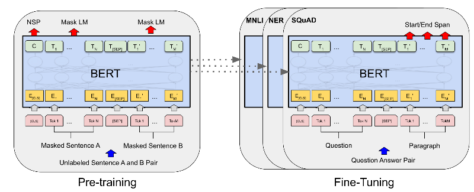
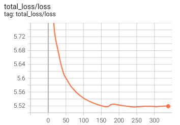
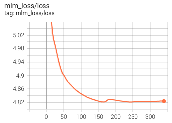
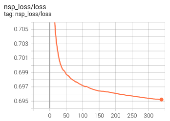

# An Implementation of pre-training and fine-tuning tasks of BERT

## Introduction
Bidirectionally Encoder Representations from Transformer (BERT) is a combining the best of both context-sensitive and Task-Agnostic. 

BERT has two steps: 
+ Pretraining: the model is trained on unlabeled data over different pretraining tasks
+ Finetuning: the model is first initialized with the pretraining parameters and all of the parameters are fine-tuned using labeled data from the downstream tasks.

<p align="center">
    
</p>

## Installation
Please install the environment following command:
```bash
pip install -r requirements.txt
```

## Pre-training BERT

The dataset for pre-training BERT is a small corpus WikiText-2

Results:

| Total Loss | MLM Loss | NSP Loss |
|--|--|--|
| <p align='center'></p> | <p align='center'></p> | <p align='center'></p> |

## Fine-tuning BERT

## Reference