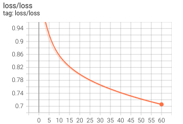
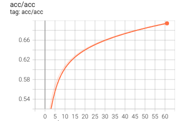
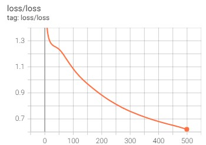
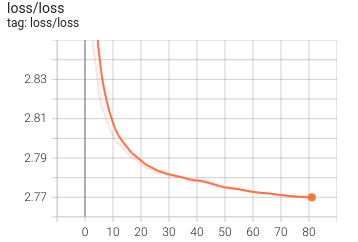
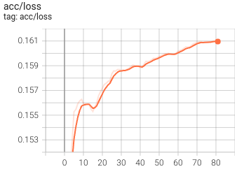

# An Implementation of pre-training and fine-tuning tasks of BERT

## Introduction
Bidirectionally Encoder Representations from Transformer (BERT) is a combining the best of both context-sensitive and Task-Agnostic. 

BERT has two steps: 
+ Pretraining: the model is trained on unlabeled data over different pretraining tasks
+ Finetuning: the model is first initialized with the pretraining parameters and all of the parameters are fine-tuned using labeled data from the downstream tasks.

<p align="center">
    
</p>

## Installation
Please install the environment following command:
```bash
pip install -r requirements.txt
```

## Pre-training BERT

The dataset for pre-training BERT is a small corpus WikiText-2

```bash
python -m src.tools.pretrain
```

Results:

| Total Loss | MLM Loss | NSP Loss |
|--|--|--|
| <p align='center'></p> | <p align='center'></p> | <p align='center'></p> |

## Fine-tuning BERT

**Single Text Classification**

The dataset for fine-tuning is a small [SNLI](https://huggingface.co/datasets/snli) dataset

```bash
python -m src.tools.text_classification
```

Results:

| Total Loss | Accuracy |
|--|--|
| <p align='center'></p> | <p align='center'></p> |

**Pair Text Classification**

The dataset for fine-tuning is a small [Semantic Textual Similarity](https://huggingface.co/datasets/stsb_multi_mt) dataset

```bash
python -m src.tools.text_pair_classification
```

Results:

| Total Loss |
|--|
| <p align='center'></p> |


**Text Tagging**

The dataset for fine-tuning is a small [Penn-Treebank]() dataset

```bash
python -m src.tools.text_tagging
```

Results:

| Total Loss | Accuracy |
|--|--|
| <p align='center'></p> | <p align='center'></p> |


**Question Answering**

```bash
python -m src.tools.question_answering
```


## Reference
+ [Natural Language Processing: Application](https://d2l.ai/chapter_natural-language-processing-applications/index.html)
+ [BERT paper](https://arxiv.org/abs/1810.04805)